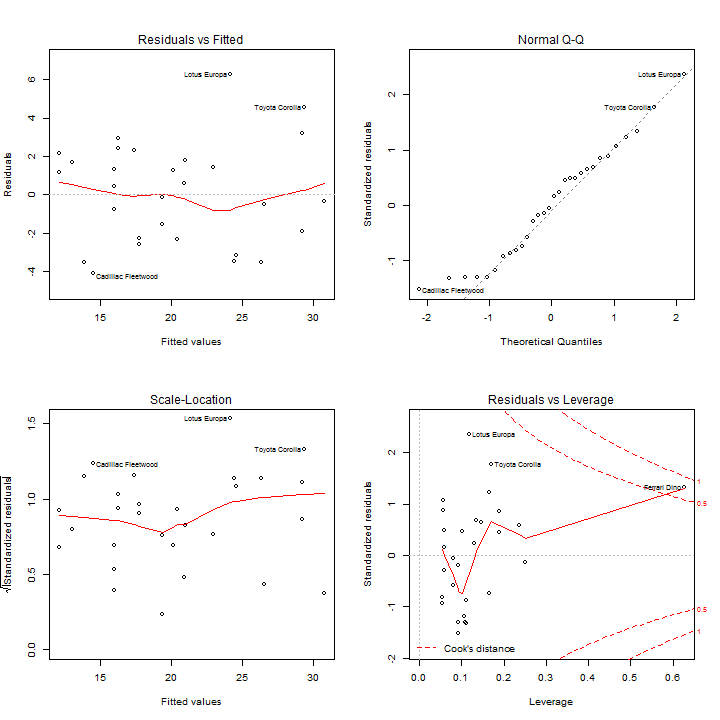

Impact of transmission type on Miles per Gallon
==============================================================

Executive Summary
-----------------

This is an R Markdown document. Markdown is a simple formatting syntax for authoring web pages (click the **Help** toolbar button for more details on using R Markdown).

When you click the **Knit HTML** button a web page will be generated that includes both content as well as the output of any embedded R code chunks within the document. You can embed an R code chunk like this:


Data exploration
----------------
From the structure of the data frame, is clear that all variables are store in numeric format. However cyl, vs, am, gear and carb could be treated as factor variables.

```r
str(mtcars)
```

```
## 'data.frame':	32 obs. of  11 variables:
##  $ mpg : num  21 21 22.8 21.4 18.7 18.1 14.3 24.4 22.8 19.2 ...
##  $ cyl : num  6 6 4 6 8 6 8 4 4 6 ...
##  $ disp: num  160 160 108 258 360 ...
##  $ hp  : num  110 110 93 110 175 105 245 62 95 123 ...
##  $ drat: num  3.9 3.9 3.85 3.08 3.15 2.76 3.21 3.69 3.92 3.92 ...
##  $ wt  : num  2.62 2.88 2.32 3.21 3.44 ...
##  $ qsec: num  16.5 17 18.6 19.4 17 ...
##  $ vs  : num  0 0 1 1 0 1 0 1 1 1 ...
##  $ am  : num  1 1 1 0 0 0 0 0 0 0 ...
##  $ gear: num  4 4 4 3 3 3 3 4 4 4 ...
##  $ carb: num  4 4 1 1 2 1 4 2 2 4 ...
```


Looking at the scatterplots of paired variables (see Fig. 1 of the appendix), it's clear that many variables are correlated with each other, thus generating potential anomalies in case of fitting a linear model with only **am** as dependent variable.

```r
pairs(mtcars, panel = panel.smooth, main = "\"mtcars\" dataset, Numeric Variables")
```


To better manage data and labels, **txType** variable is generated from **am** variable and is transformed to a factor with readable levels:

```r
txType <- as.factor(mtcars$am)
levels(txType) <- c("automatic", "manual")
```


Fitting linear models
---------------------
Looking at the distribution of **MPG** depending on the type of transmission, it is clearly visible that manual trasmission has higher values for **MPG** (see Fig.1 of the appendix). Thus at a first glance **manual transmission is better for MPG**.

```r
boxplot(mtcars$mpg ~ txType, col = "blue", main = "Fig. 2 - MPG by type of transmission", 
    xlab = "Transmission type", ylab = "MPG, Miles/(US) gallon")
```


Let' fit a univariate linear model to quantify how different is MPG between automatic and manual transmission:


```r
fit <- lm(mtcars$mpg ~ txType)
summary(fit)
```

```
## 
## Call:
## lm(formula = mtcars$mpg ~ txType)
## 
## Residuals:
##    Min     1Q Median     3Q    Max 
## -9.392 -3.092 -0.297  3.244  9.508 
## 
## Coefficients:
##              Estimate Std. Error t value Pr(>|t|)    
## (Intercept)     17.15       1.12   15.25  1.1e-15 ***
## txTypemanual     7.24       1.76    4.11  0.00029 ***
## ---
## Signif. codes:  0 '***' 0.001 '**' 0.01 '*' 0.05 '.' 0.1 ' ' 1
## 
## Residual standard error: 4.9 on 30 degrees of freedom
## Multiple R-squared:  0.36,	Adjusted R-squared:  0.338 
## F-statistic: 16.9 on 1 and 30 DF,  p-value: 0.000285
```

The model seems quite good: p-value of the modelan coefficients are both significant and it is possible to state that: **holding all other variables constant**, swithcing from automatic to manual transmission, one can travel 7.24 miles more per gallon. Where the **average MPG** for automatic and manual transmission are respectively 17.15 and 24.39. **However**, when checking residuals (see Fig. 3 in the appendix), it's clear that residuals suffer from an increase in variance for observations having manual transmission (Fig. 3.3).

To try to get rid of this issue, we can adjust our univariate model. To choose which is the best variable to add we can recursively define all the bivariate models with the remaining variables:

```r
columns <- colnames(mtcars)
columns <- columns[!(columns %in% c("mpg", "am"))]
formulas <- paste0("mtcars$mpg~txType+", columns)
```


Fit all the models:

```r
numModels <- length(formulas)
bivariateFit <- lapply(1:numModels, function(x) lm(formula = formulas[x], mtcars))
```


And choose among them the one that, compared with the univariate model **using anova method**, yields the lowest p-value:

```r
pvalues <- sapply(1:numModels, function(x) anova(fit, bivariateFit[[x]])[2, 
    6])
bestBivariate <- bivariateFit[[which.min(pvalues)]]
summary(bestBivariate)
```

```
## 
## Call:
## lm(formula = formulas[x], data = mtcars)
## 
## Residuals:
##    Min     1Q Median     3Q    Max 
## -4.384 -2.264  0.137  1.697  5.866 
## 
## Coefficients:
##              Estimate Std. Error t value Pr(>|t|)    
## (Intercept)  26.58491    1.42509   18.65  < 2e-16 ***
## txTypemanual  5.27709    1.07954    4.89  3.5e-05 ***
## hp           -0.05889    0.00786   -7.50  2.9e-08 ***
## ---
## Signif. codes:  0 '***' 0.001 '**' 0.01 '*' 0.05 '.' 0.1 ' ' 1
## 
## Residual standard error: 2.91 on 29 degrees of freedom
## Multiple R-squared:  0.782,	Adjusted R-squared:  0.767 
## F-statistic:   52 on 2 and 29 DF,  p-value: 2.55e-10
```


Selected model introduces **hp** as dependent variabile, which makes a lot of sense since we are trying to analyse **MPG** consumption.
Now, looking at the diagnostics plot (Fig. 4) it is possible to see that variance is more regularly distributed.


Appendix
----------
 


 


 


 


```r
plot(mtcars$hp, mtcars$mpg, col = txType, pch = 19, ylab = "MPG, Miles/(US) gallon", 
    xlab = "Gross Horsepower", main = "Fig. 5 - mpg ~ transmission type + horsepower")
abline(bestBivariate$coefficients[1], bestBivariate$coefficients[3], lw = 2)
abline(bestBivariate$coefficients[1] + bestBivariate$coefficients[2], bestBivariate$coefficients[3], 
    col = "red", lw = 2)
```

 

