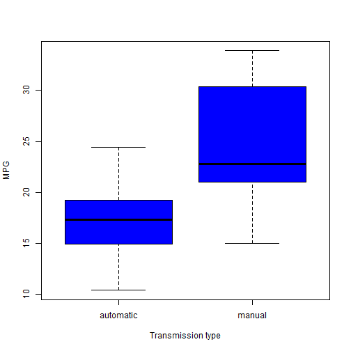
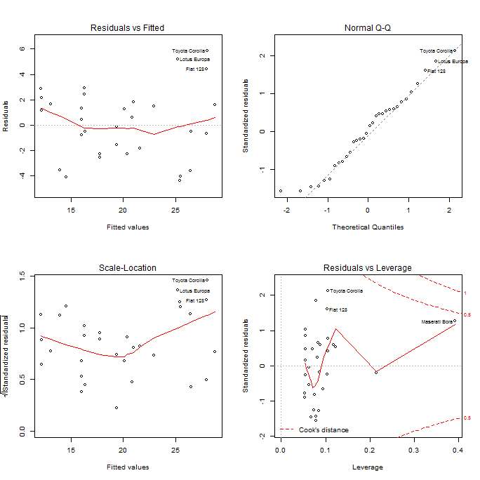
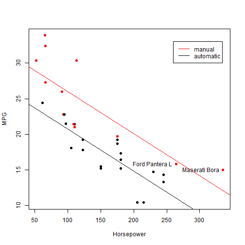
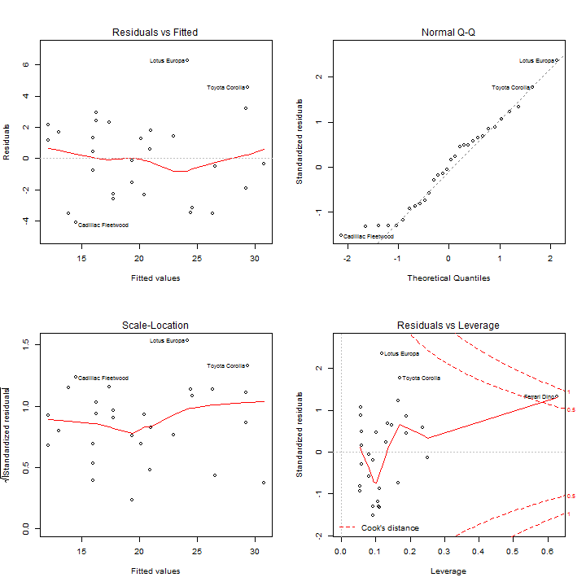
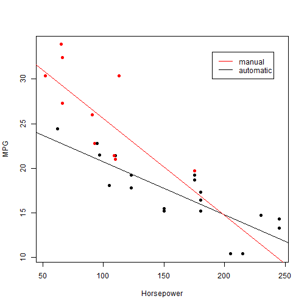

Impact of transmission type on Miles per Gallon
==============================================================

Executive Summary
-----------------

In this analysis MPG and relationship with automatic vs. manual transmission have been compared for 32 different car models. Results obtained can be summarized in 6 key points:
- cars with **manual transmission are better** for **MPG**; while cars with automatic transmission have a lower level of MPG
- holding other features constant, **manual transmission** leads to a positive **increase in MPG of about 5.2**
- **Horsepower** is an **important variable** when assessing MPG jointly with transmission type: **the more the horsepower the less the MPG**
- **Results** obtained **are robust** and subject to relatively **little uncertainity**
- Model obtained suffers anyway from the fact that **few observations are available for cars with hp > 200 and manual transmission**
- **Taking more observations** for cars with hp > 200 and manual transmission could help **strengthen results in the hp > 200 range**


Data exploration
----------------
All variables in the mtcars data frame are store in **numeric format**. However cyl, vs, am, gear and carb will be treated as factor variables. In particular for transmission type it's better to also redefine levels in a readable format:


```r
data$am <- as.factor(data$am)
levels(data$am) <- c("automatic", "manual")
```


Doing so we can immediately compare MPG to transmission type **(see Fig. 1 in the appendix)**. From this chart is clearly visible that **cars with manual transmission are better for MPG**.

Linear model fitting
--------------------

The strategy applied for selecting the best model is 3-step and aims at preserving **am** as predictor so to answer the relevant question.

**Step 1:** fit a uni-variate model with **am** as predictor

```r
vars <- "am"
outcome <- "mpg"
formula <- paste0(outcome, "~", paste0(vars, collapse = "+"))
fit <- lm(formula, data)
```


**Step 2:** keeping **am** as predictor, **generate all possible bivariate models** with remaining columns. Compare bi-variate models with uni-variate model using **anova method** and keep the one whose comparison has the **smallest p-value**, but only if **am** is statistically significant.

**Step 3:** Repeat step 2 continuously adding the best predictor until p-value of **am** predictor looses statistic significance


```r
# step 2 and 3
loop <- TRUE
while (loop == TRUE) {
    # generate all possible formulas, break if all vars are being used
    remainingVars <- setdiff(colnames(data), c(outcome, vars))
    if (length(remainingVars) == 0) {
        break
    }
    newFormulas <- paste0(formula, "+", remainingVars)
    
    # generate new linear models
    numModels <- length(newFormulas)
    newFit <- lapply(1:numModels, function(x) lm(newFormulas[x], data))
    
    # compare new linear models with baseline model
    anovaPvalues <- sapply(1:numModels, function(x) anova(fit, newFit[[x]])[2, 
        6])
    candidateFit <- which.min(anovaPvalues)
    
    # update baseline model if a new better model has been found
    betterModel <- anovaPvalues[candidateFit] < 0.05
    amSignif <- summary(newFit[[candidateFit]])$coefficients[[2, 4]] < 0.05
    if (betterModel & amSignif) {
        formula <- newFormulas[candidateFit]
        fit <- newFit[[candidateFit]]
        vars <- c(vars, remainingVars[candidateFit])
    } else {
        loop <- FALSE
    }
}
```


The final output is a bi-variate model with **am** and **hp** as predictors. This result makes sense also at an intuitive level since **horsepower** is something to keep into consideration when evaluating fuel consumption of engines.

************
Selected model assessment
-------------------------
Let's check how good is the model that was found:

```
## 
## Call:
## lm(formula = newFormulas[x], data = data)
## 
## Residuals:
##    Min     1Q Median     3Q    Max 
## -4.384 -2.264  0.137  1.697  5.866 
## 
## Coefficients:
##             Estimate Std. Error t value Pr(>|t|)    
## (Intercept) 26.58491    1.42509   18.65  < 2e-16 ***
## ammanual     5.27709    1.07954    4.89  3.5e-05 ***
## hp          -0.05889    0.00786   -7.50  2.9e-08 ***
## ---
## Signif. codes:  0 '***' 0.001 '**' 0.01 '*' 0.05 '.' 0.1 ' ' 1
## 
## Residual standard error: 2.91 on 29 degrees of freedom
## Multiple R-squared:  0.782,	Adjusted R-squared:  0.767 
## F-statistic:   52 on 2 and 29 DF,  p-value: 2.55e-10
```


All coefficients are statistically highly significant. Looking at the **residual diagnostic plots (see Fig. 2)** we can see that they are normally distributed with no visible pattern.

Conclusions and uncertainty in results
----------------------
We can conclude that: 

- cars with manual transmission are better for **MPG**
- according to our model a hypothetical **car with automatic transmission and 50 hp** has an estimated **MPG of 23.6405**:

```r
fit$coefficients[3] * 50 + fit$coefficients[1]
```


- holding horsepower constants choice of **manual transmission allows to travel 5.2771** more per each gallon
- horsepower has also an effect on MPG and, for the same kind of transmission, **each horsepower added, decreases MPG by 0.0589**


We can see that all obtained coefficients have relatively narrow 95% confidence intervals:

```
##                2.5 %   97.5 %
## (Intercept) 23.67027 29.49956
## ammanual     3.06918  7.48499
## hp          -0.07496 -0.04282
```


Lastly, we can check if any point badly influences the results. Actually 2 car models are **highly influential (see Fig. 3)**:

```
## [1] "Ford Pantera L" "Maserati Bora"
```


To assess the impact of influential points we can fit a new model excluding these observations and adding an interaction term between hp and transmission type: **mpg~am+hp+am*hp**. P-values and residuals plots **(see Fig. 4)** indicate this model is valid.

```
## (Intercept)    ammanual          hp ammanual:hp 
##   1.013e-12   7.224e-03   5.860e-05   9.795e-02
```

Looking at fitted lines **(see Fig. 5)**, we now see that **better performance of manual transmission is now not true for values of hp higher than 200**. To decrease the uncertainty on transmission performance in the range of 200 hp, **more observations** of cars with manual transmission and hp in this range could be taken.

************
Appendix
----------------

**Figure 1: Distribution of MPG by tyoe if transmission**

 


**Figure 2: residuals diagnostics plots for selected linear model**

 

************

**Figure 3: regression lines and influential points**

 


**Figure 4: residuals diagnostics plots for linear model without influential points**

 

************

**Figure 5:regression lines for model without influential points and interaction (hp,am)**

 

